# ThimarHub Fruit Ecommerce Mobile App

## Screenshots

| Splash | Onboarding | Second Onboarding | Login |
|:------:|:----------:|:----------------:|:-----:|
| 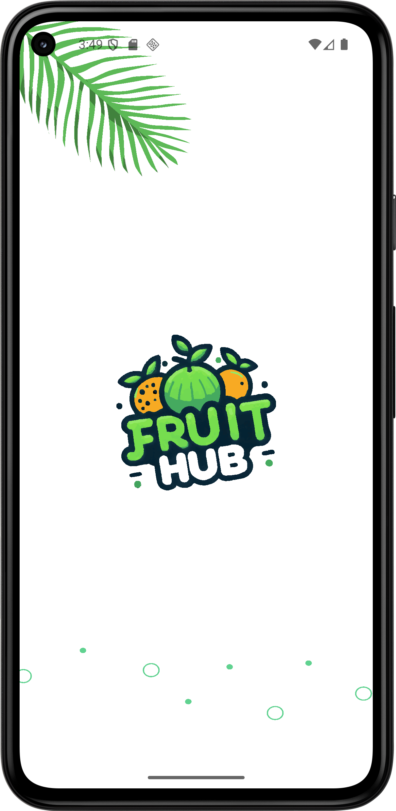 | 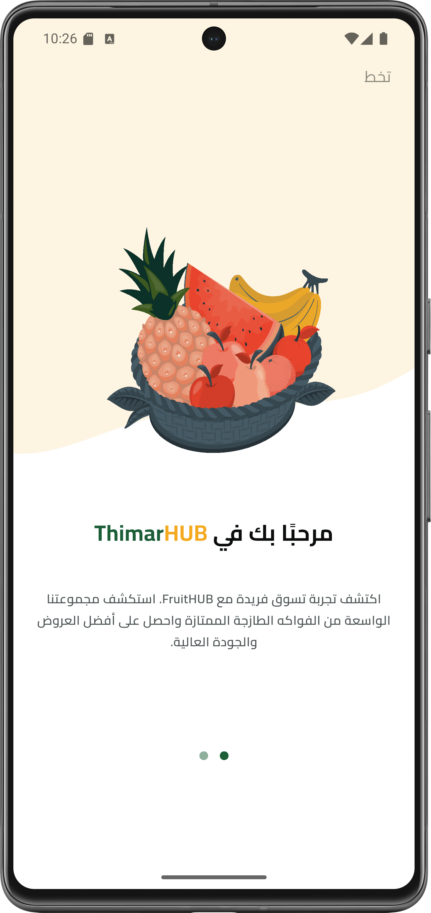 | 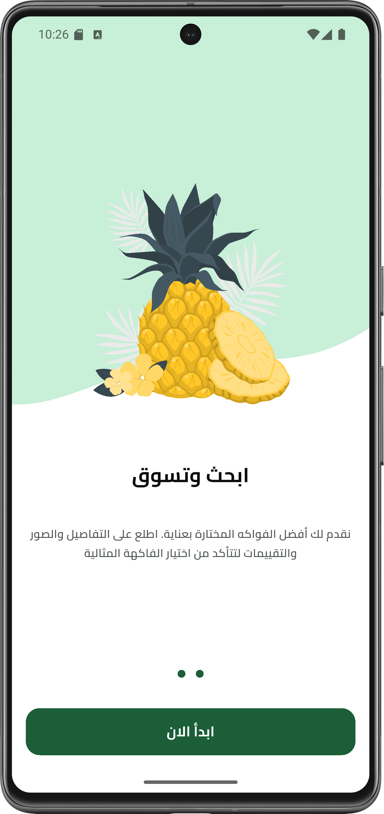 | 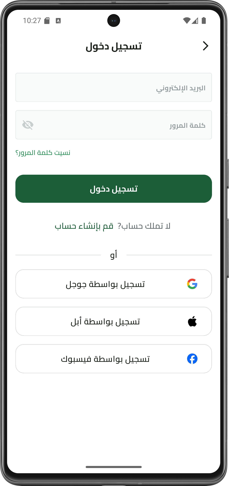 |

| Sign Up | Main | Products | Filter |
|:-------:|:----:|:--------:|:------:|
| 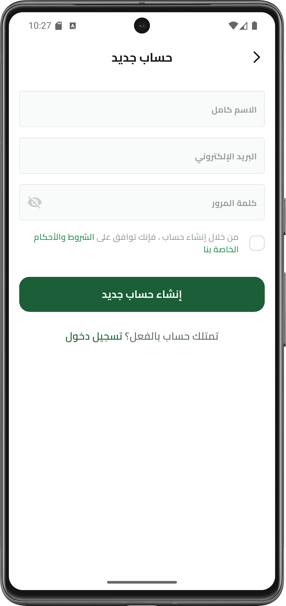 |  | 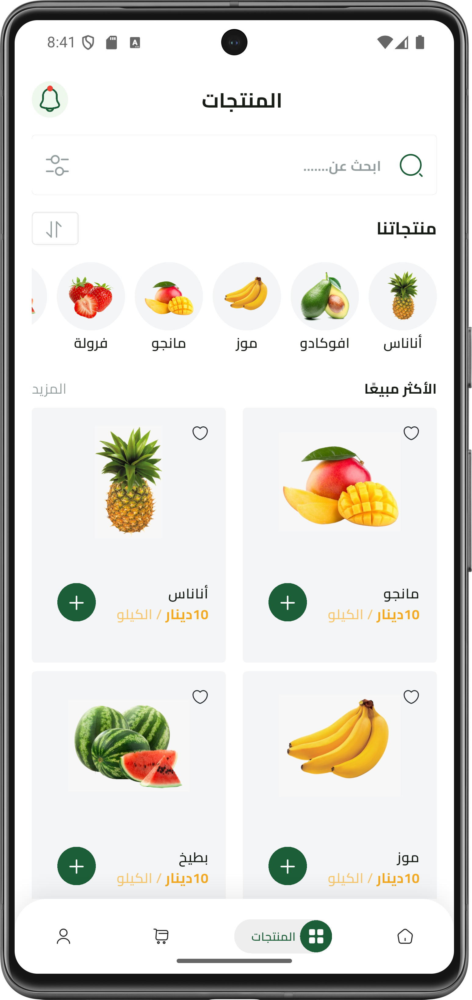 | 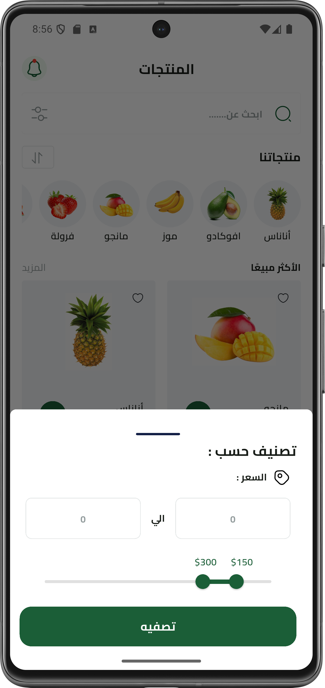 |

| Second Filter | Cart | My Orders | My Purchases |
|:-------------:|:----:|:---------:|:------------:|
| 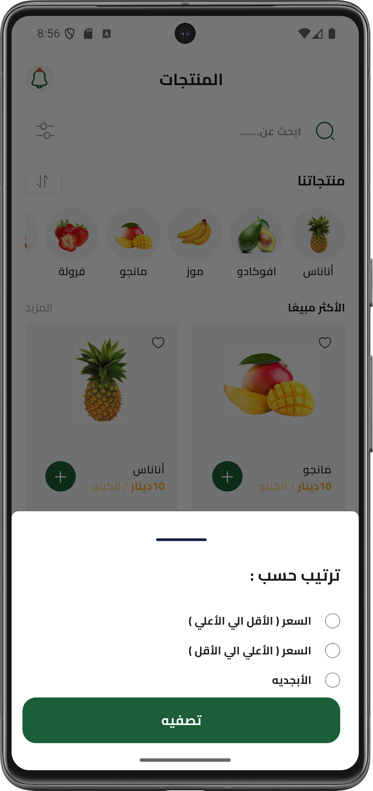 | 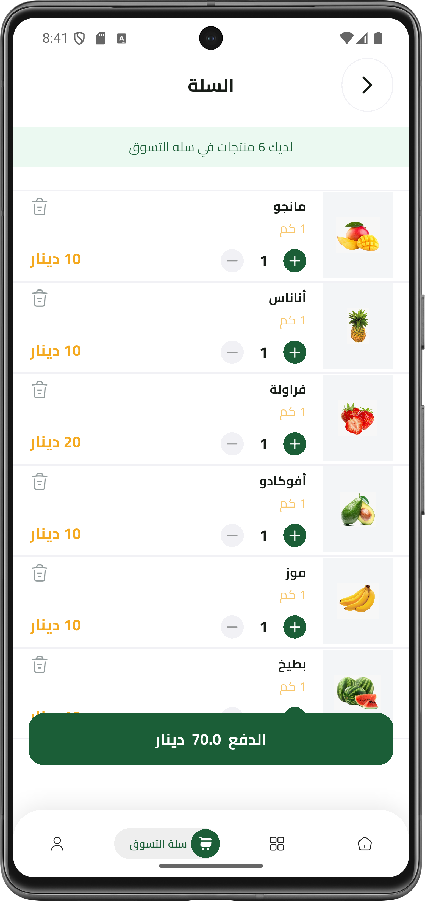 | 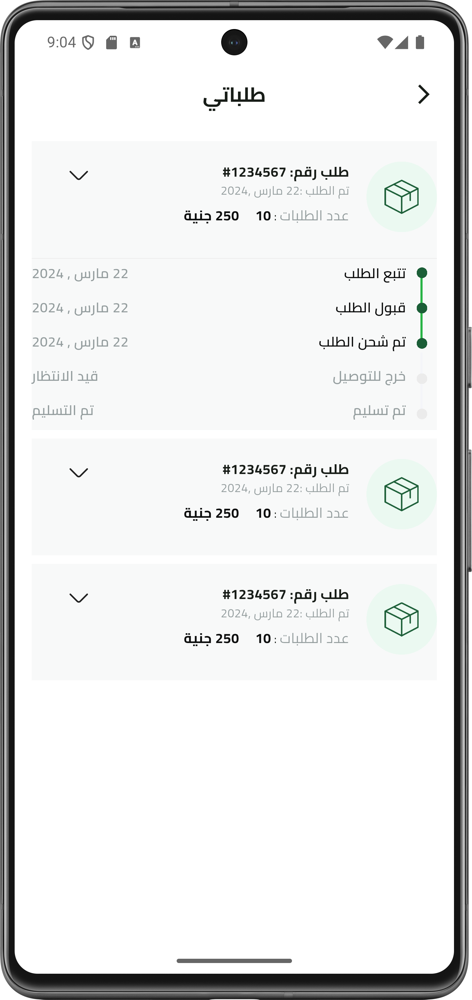 | 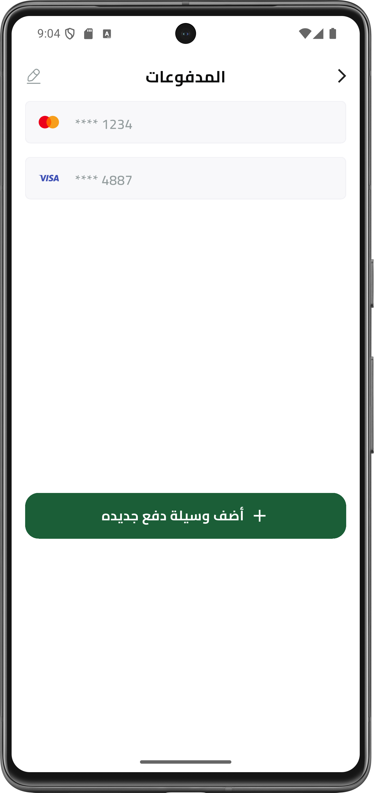 |

| Personal Account | Edit Personal Info | About Us | Shipping Info |
|:----------------:|:-----------------:|:--------:|:-------------:|
| 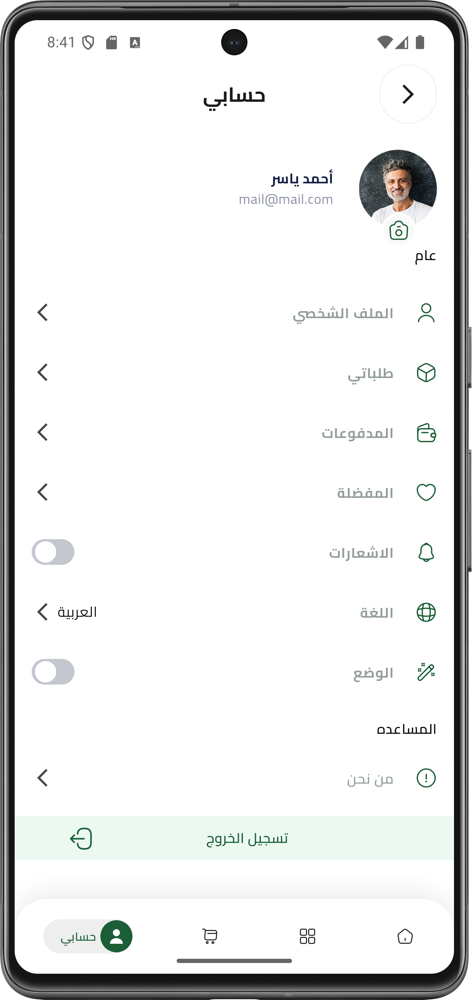 | 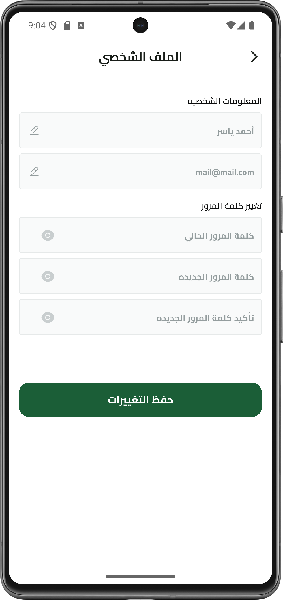 |  | 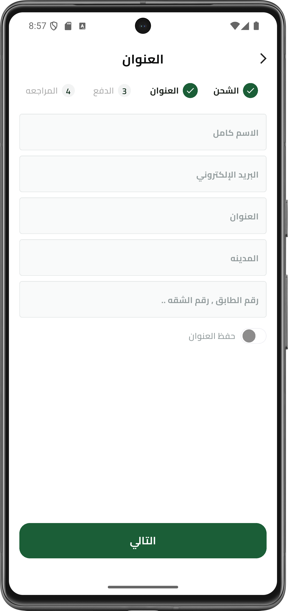 |

| Payment Method | Payment Card | Add New Card | Payment Ticket |
|:--------------:|:-----------:|:------------:|:--------------:|
| 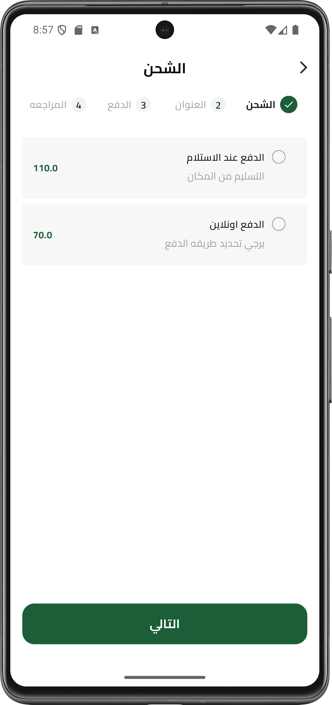 |  | 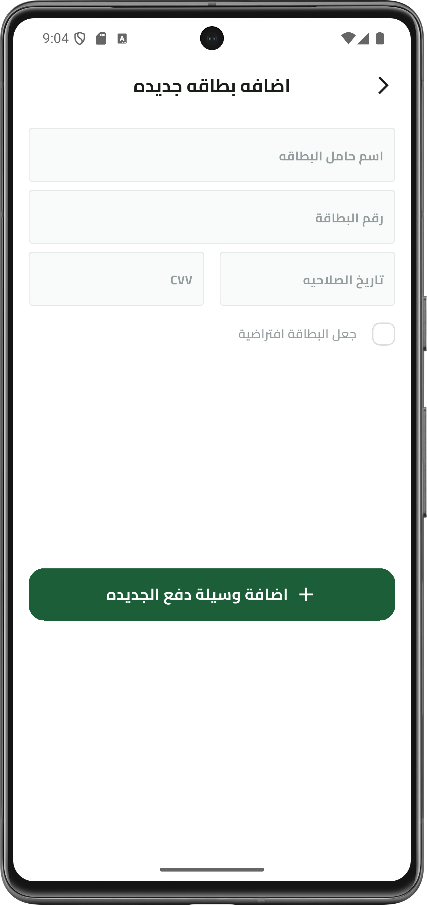 |  |

| PayPal | PayPal Second |
|:------:|:-------------:|
|  |  |